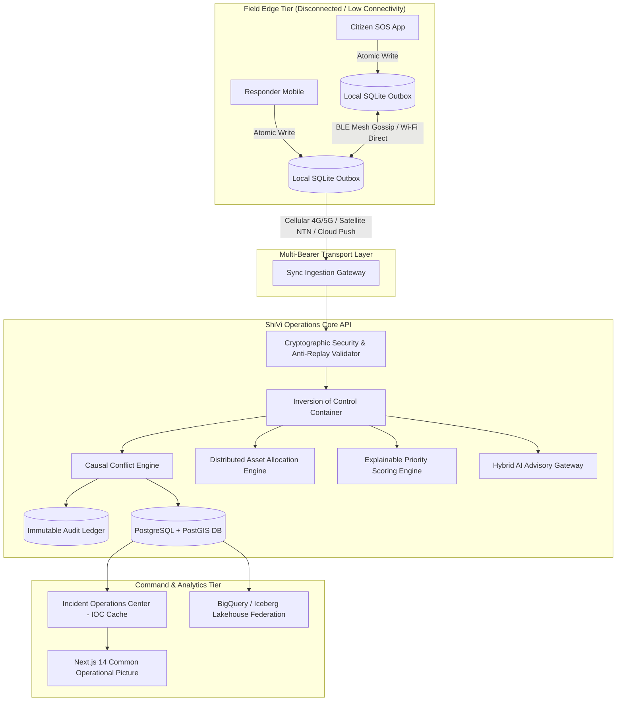

# ShiVi (Smart Hybrid Intelligent Virtual Integration)
### *शिवी: Local-First Disaster Coordination & Common Operational Picture Platform*

> **The mission-critical execution layer for emergency response teams operating when telecommunications, power grids, and central cloud infrastructure have collapsed.**

[]()
[]()
[]()
[]()
[]()
[]()

---

## 📖 Table of Contents

1. [Executive Summary & Problem Statement](#-executive-summary--problem-statement)
2. [The 5 Non-Negotiable System Invariants](#-the-5-non-negotiable-system-invariants)
3. [Global Architecture & Data Flow](#-global-architecture--data-flow)
4. [Exhaustive Backend Core Module Directory (13 Modules)](#-exhaustive-backend-core-module-directory-13-modules)
5. [Field Mobile Client Architecture (Flutter + SQLite)](#-field-mobile-client-architecture-flutter--sqlite)
6. [Web Command Center (Next.js 14 + MapLibre)](#-web-command-center-nextjs-14--maplibre)
7. [Omni-Bearer Mesh Synchronization (BLE, Wi-Fi, Cellular, Satellite)](#-omni-bearer-mesh-synchronization)
8. [Complete REST API Reference](#-complete-rest-api-reference)
9. [Operational Disaster Walkthroughs & Scenarios](#-operational-disaster-walkthroughs--scenarios)
10. [Security, Cryptographic Identity & Anti-Replay](#-security-cryptographic-identity--anti-replay)
11. [Federated Lakehouse & Declarative GCP Provisioning](#-federated-lakehouse--declarative-gcp-provisioning)
12. [Quickstart, Docker & Verification Instructions](#-quickstart-docker--verification-instructions)
13. [Complete 30-Document Architectural Specification Portfolio](#-complete-30-document-architectural-specification-portfolio)
14. [License & Attribution](#-license--attribution)

---

## 📌 Executive Summary & Problem Statement

During catastrophic disasters (e.g. Super Cyclones, flash floods, major earthquakes, and landslides), the first **72 hours** determine the boundary between survival and mass casualties. Yet, precisely when coordination is most vital:
- **Cellular towers lose power or backhaul**, leaving responders blind and unable to sync.
- **Traditional cloud-first architectures fail completely** because mobile clients freeze or discard writes when offline.
- **Blind Last-Write-Wins (LWW) sync creates fatal overwrites** (e.g. overwriting a collapsed bridge warning with an outdated "passable" note).
- **Physical asset deadlocks strand rescue crews** when two squads attempt to claim the same evacuation boat or high-capacity dewatering pump.
- **Unverified AI hallucinations** can misroute emergency squads into hazard zones.

**ShiVi** solves these failure modes by providing a **local-first, conflict-aware, cryptographically verified operational platform** that functions seamlessly across complete radio blackouts and high-speed command hubs.

---

## ⚡ The 5 Non-Negotiable System Invariants

```text
┌─────────────────────────────────────────────────────────────────────────────┐
│                      SHIVI CORE SYSTEM INVARIANTS                           │
├─────────────────────────────────────────────────────────────────────────────┤
│ 1. LOCAL-FIRST DURABILITY                                                   │
│    Zero data loss. Every mutation commits to local SQLite before network.   │
├─────────────────────────────────────────────────────────────────────────────┤
│ 2. OMNI-BEARER MESH CONTINUITY                                              │
│    BLE Mesh ◄► Wi-Fi Direct ◄► 2G/3G/4G/5G Cellular ◄► Satellite NTN.       │
├─────────────────────────────────────────────────────────────────────────────┤
│ 3. ZERO SILENT OVERWRITES & SAFETY FREEZE                                   │
│    Contradictions freeze dependent operations; human review required.       │
├─────────────────────────────────────────────────────────────────────────────┤
│ 4. PHYSICAL POSSESSION OVER VIRTUAL INTENT                                  │
│    NFC/QR/GPS proximity (≤15m) decides custody + automated substitution.   │
├─────────────────────────────────────────────────────────────────────────────┤
│ 5. GOVERNED HYBRID AI ADVISORY                                              │
│    AI provides advice with confidence bounds; humans authorize actions.    │
└─────────────────────────────────────────────────────────────────────────────┘
```

---

## 🏗️ Global Architecture & Data Flow



---

## 📦 Exhaustive Backend Core Module Directory (13 Modules)

The backend (`apps/core-api/app/modules/`) is architected as a modular monolith utilizing strict Protocol-based Inversion of Control (IoC):

### 1. `incidents` — Incident Management & Triage
- **Role:** Full lifecycle tracking of emergencies (`REPORTED`, `TRIAGED`, `IN_PROGRESS`, `CONTAINED`, `RESOLVED`, `CLOSED`).
- **Priority Algorithm:** Computes an explainable 0–100 score using severity weight ($30\%$), casualty scale ($25\%$), vulnerability multipliers ($20\%$), infrastructure vulnerability ($15\%$), and time-decay penalty ($10\%$).

### 2. `conflicts` — Causal Conflict Engine & Safety Freeze
- **Role:** Compares concurrent state vectors across reconnecting field nodes.
- **Safety Mechanism:** Detects life-safety contradictions (e.g. Route `USABLE` vs `BLOCKED`, Facility `OPERATIONAL` vs `FLOODED`). Automatically places the entity into `UNCERTAIN` state and immediately freezes all dependent rescue tasks.

### 3. `assets` — Distributed Physical Asset Contention Engine
- **Role:** Eliminates asset deadlocks between disconnected teams claiming the same physical hardware.
- **Resolution Strategy:** Evaluates physical custody proof (NFC badge scan or GPS proximity $\le 15\text{m}$). If neither or both possess physical proof, grants allocation to the higher-severity operational mission and automatically dispatches an equivalent substitute asset from the nearest regional depot.

### 4. `sync` — Multi-Bearer Causal Synchronization
- **Role:** Ingests batched event envelopes pushed from mobile devices.
- **Features:** Idempotent deduplication, server cursor pagination, vector clock progression, and mesh relay provenance tracking (`relay_hops`, `relayed_by_devices`, `initial_bearer`).

### 5. `identity` — Cryptographic Identity & Anti-Replay
- **Role:** Offline device authorization and cryptographic tamper prevention.
- **Mechanisms:** Validates hardware key signatures (Ed25519/ECDSA), strictly enforces monotonic sequence progression ($Seq_N > Seq_{N-1}$), recalculates SHA-256 hash chains, and rejects replayed or clock-manipulated events ($\Delta t \le 120\text{s}$).

### 6. `dashboard` — Incident Operations Center (IOC) High-Throughput Hub
- **Role:** Real-time Common Operational Picture feed for command centers.
- **Optimizations:** In-memory 5-second dynamic TTL caching with mutation-triggered invalidation, viewport bounding-box spatial clipping (`bbox=min_lon,min_lat,max_lon,max_lat`), and Resource Saturation Index ($RSI$) computation.

### 7. `tasks` — Responder Task Dispatch & Execution
- **Role:** Assigns operational tasks (Evacuation, Sandbagging, Medical Extraction) to squads.
- **Dynamic Re-routing:** Automatically transitions tasks to `FROZEN` if route conflicts emerge, resuming only after supervisor adjudication.

### 8. `evidence` — Cryptographic Evidence Ingestion
- **Role:** Stores geotagged photographs, voice recordings, and sensor telemetry.
- **Integrity:** Generates SHA-256 digest on upload; stores binary payloads in MinIO/S3 object storage; strips/validates EXIF metadata.

### 9. `audit` — Append-Only Immutable Ledger
- **Role:** Full legal and operational auditability of all disaster actions.
- **Structure:** Append-only ledger recording actor ID, device ID, exact timestamp, state diff, causal parent, and supervisor justification.

### 10. `integrations` — Official Disaster Warning Ingestion
- **Role:** Connects with national and international early warning ecosystems.
- **Protocols:** Ingests NDMA SACHET Common Alerting Protocol (CAP v1.2 XML/JSON), India Meteorological Department (IMD) cyclone forecasts, and NDEM geospatial feeds.

### 11. `intelligence` — Governed Hybrid AI Advisory Gateway
- **Role:** AI-assisted summarization, optical field character recognition, and SOP recommendation.
- **Safeguards:** Deterministic rule fallback when AI is offline or low-confidence; human verification required for all actionable output.

### 12. `resilience` — Fault Tolerance & Loop Prevention
- **Role:** System-wide resilience under extreme concurrency and radio mesh relays.
- **Patterns:** Exponential backoff with full jitter, circuit breakers, dead-letter queues (DLQ), and `LoopGuard` mesh cycle prevention ($Hops \le 5$).

### 13. `verifications` — Multi-Signature Verification & Closure
- **Role:** Final incident review and authorized closure protocol.
- **Requirements:** Verifies that required evidence digests exist and supervisor authorization is cryptographically recorded.

---

## 📱 Field Mobile Client Architecture (Flutter + SQLite)

The mobile client (`apps/field-mobile/`) is designed for extreme hardware constraints:

```text
┌─────────────────────────────────────────────────────────────┐
│                 ShiVi Flutter Field Client                  │
├─────────────────────────────────────────────────────────────┤
│ 1. DRIFT SQLITE OUTBOX                                      │
│    Guarantees ACID storage for events, evidence, and assets. │
├─────────────────────────────────────────────────────────────┤
│ 2. HARDWARE PERFORMANCE TIER ADAPTER                        │
│    - Tier Low (<3GB RAM): Plain list, no raster animations. │
│    - Tier Mid (3-6GB RAM): Vector maps, 30fps transitions.  │
│    - Tier High (>6GB RAM): 3D terrain, high-res aerials.    │
├─────────────────────────────────────────────────────────────┤
│ 3. MEDIA ADAPTIVE COMPRESSOR                                │
│    Dynamically downsamples photos (1080p -> 720p -> 480p)   │
│    based on active network bearer and battery level.        │
├─────────────────────────────────────────────────────────────┤
│ 4. BLUETOOTH MESH FRAMING & CRC-32 ENGINE                   │
│    Chunks JSON payloads into 480B BLE GATT frames.          │
└─────────────────────────────────────────────────────────────┘
```

---

## 💻 Web Command Center (Next.js 14 + MapLibre)

The command web hub (`apps/command-web/`) provides real-time situational awareness:
- **Live Common Operational Picture (COP):** Geospatial rendering of incidents, field responders, closed routes, and active shelters via MapLibre GL.
- **Adjudication Workspace:** Side-by-side evidence inspection (photos, sensor logs) for resolving life-safety route and shelter conflicts.
- **Resource Saturation Index (RSI):** Visual heatmaps identifying overloaded rescue units and equipment shortages.
- **Audit Ledger Explorer:** Step-by-step cryptographic timeline reconstruction of every incident.

---

## 📡 Omni-Bearer Mesh Synchronization

```text
┌─────────────────┬──────────┬──────────────┬───────────────┬──────────────────┐
│ Bearer Layer    │ Max MTU  │ Internet Req │ P2P Supported │ Battery Profile  │
├─────────────────┼──────────┼──────────────┼───────────────┼──────────────────┤
│ Wi-Fi Broadband │ 64 KB    │ YES          │ NO            │ Low (Tier 2)     │
│ Cellular 4G/5G  │ 32 KB    │ YES          │ NO            │ Medium (Tier 3)  │
│ Cellular 2G/3G  │ 2 KB     │ YES          │ NO            │ Medium (Tier 3)  │
│ Satellite NTN   │ 256 B    │ YES (Orbit)  │ NO            │ High (Tier 5)    │
│ Wi-Fi Direct    │ 16 KB    │ NO           │ YES (High-BW) │ High (Tier 4)    │
│ BLE 5.0+ Mesh   │ 480 B    │ NO           │ YES (Gossip)  │ Ultra-Low (Tier 1│
└─────────────────┴──────────┴──────────────┴───────────────┴──────────────────┘
```

---

## 🔌 Complete REST API Reference

| HTTP Verb | Endpoint Path | Authorization Role | Description |
| :--- | :--- | :--- | :--- |
| `POST` | `/v1/auth/login` | Public | Authenticates responder/commander and issues JWT |
| `POST` | `/v1/sync/push` | Responder / Commander | Ingests batched offline outbox events and mesh relays |
| `GET` | `/v1/sync/pull` | Responder / Commander | Fetches causal delta updates since last server cursor |
| `POST` | `/v1/incidents` | Any Authenticated | Creates a new emergency incident with priority score |
| `GET` | `/v1/incidents` | Any Authenticated | Lists incidents with bounding box and severity filters |
| `GET` | `/v1/incidents/{id}` | Any Authenticated | Retrieves single incident details and causal history |
| `POST` | `/v1/conflicts/adjudicate` | Incident Commander | Adjudicates conflicting field reports with mandatory reason |
| `POST` | `/v1/assets/allocate` | Responder / Commander | Claims physical equipment with proof-of-custody checks |
| `POST` | `/v1/tasks` | Incident Commander | Creates and dispatches a responder field task |
| `GET` | `/v1/tasks/assigned` | Field Responder | Lists tasks assigned to active responder squad |
| `POST` | `/v1/evidence/upload` | Responder / Commander | Uploads geotagged photo/audio with SHA-256 checksum |
| `GET` | `/v1/dashboard/ioc-summary` | Any Authenticated | High-throughput cached summary with spatial clipping |
| `GET` | `/v1/audit/ledger` | Incident Commander | Explores immutable cryptographic audit ledger |
| `GET` | `/health` | Public | System health check (Postgres, Redis, Object Store) |

---

## 🎬 Operational Disaster Walkthroughs & Scenarios

### Scenario A: The Flood Evacuation Route Contradiction
1. **The Event:** A flash flood hits Sector 7. Citizen reports 8 trapped residents.
2. **The Conflict:** Scout Alpha logs Route-14 as `USABLE` via geotagged photo. Ten minutes later, Volunteer Beta discovers an undercut culvert and logs Route-14 as `BLOCKED`.
3. **The ShiVi Response:** Upon reconnection, the Causal Conflict Engine detects contradictory route viability states. Route-14 is immediately set to `UNCERTAIN` and dependent evacuation tasks are automatically **frozen**.
4. **The Adjudication:** The Incident Commander inspects both evidence items, talks to the scout, marks Route-14 `BLOCKED`, and re-routes the evacuation team via Sector 9 Causeway.

### Scenario B: The "Data Mule" Bluetooth Mesh Relay
1. **The Event:** A mountain landslide destroys cell towers in an isolated valley.
2. **The Relay:** Field Scout records a landslide casualty report offline. App automatically fragments the payload into 480B BLE packets.
3. **The Transfer:** A medical supply drone/responder vehicle passes within 40 meters. The two phones execute an epidemic gossip exchange over BLE.
4. **The Upload:** The supply vehicle drives back into cell coverage; its background orchestrator automatically pushes the scout's incident report to the central cloud.

---

## 🔒 Security, Cryptographic Identity & Anti-Replay

- **Hardware-Bound Identity:** Every field device registers an asymmetric public key (Ed25519/ECDSA).
- **Monotonic Hash Chains:** Every offline mutation references $Hash_{N-1}$, creating an unbreakable cryptographic chain of custody:
  $$H_N = \text{SHA-256}(H_{N-1} \parallel \text{EventID} \parallel \text{Seq}_N \parallel \text{Payload} \parallel \text{Timestamp})$$
- **Clock Drift Clamping:** Server clamps timestamps to $\le 120\text{s}$ drift from true NTP time; mutations outside drift bounds are quarantined.
- **Zero Elevation of Privilege:** Role capabilities are embedded in cryptographic tokens and cross-checked against the immutable role matrix during sync.

---

## ☁️ Federated Lakehouse & Declarative GCP Provisioning

ShiVi includes full enterprise-grade BigQuery and Apache Iceberg data federation:
- **Declarative Pipeline (`deployment.yaml`):** Provisions BigQuery datasets, Dataform SQLX pipelines, and DTS transfers with mandatory `datacloud: "antigravity"` resource attribution.
- **Lakehouse Catalog:** Queries federated parquet/Iceberg tables across GCP and Azure for multi-year climate risk analysis without data duplication.

---

## 🚀 Quickstart, Docker & Verification Instructions

### 1. Launch Infrastructure Stack
```bash
# Clone the repository
git clone https://github.com/Hellthefox808/ShiVi-D.git -b Ravi-Ranjan-Singh
cd ShiVi

# Copy environment configuration
cp .env.example .env

# Launch PostgreSQL, PostGIS, Redis, MinIO, Core API, and Command Web
docker compose up -d --build
```

### 2. Run Automated Pytest Suite (47 Tests)
```bash
.\.venv\Scripts\pytest
```

### 3. Run End-to-End Multi-Device Concurrency Simulation
```bash
.\.venv\Scripts\python scripts/simulate_p0_demo.py
```

---

## 📚 Complete 30-Document Architectural Specification Portfolio

1. [01_EXECUTIVE_PROJECT_BRIEF.md](file:///d:/ShiVi,/docs/01_EXECUTIVE_PROJECT_BRIEF.md): Executive charter, problem statement, and impact metrics.
2. [02_RESEARCH_AND_EVIDENCE_REVIEW.md](file:///d:/ShiVi,/docs/02_RESEARCH_AND_EVIDENCE_REVIEW.md): Analysis of historical disaster coordination failures.
3. [03_PRODUCT_REQUIREMENTS_DOCUMENT.md](file:///d:/ShiVi,/docs/03_PRODUCT_REQUIREMENTS_DOCUMENT.md): Comprehensive functional and non-functional requirements.
4. [04_FUNCTIONAL_SPECIFICATION_DOCUMENT.md](file:///d:/ShiVi,/docs/04_FUNCTIONAL_SPECIFICATION_DOCUMENT.md): Core functional workflows and operational roles.
5. [05_CONTEXT_LOOP_SPECIFICATION.md](file:///d:/ShiVi,/docs/05_CONTEXT_LOOP_SPECIFICATION.md): P0 8-step verified operational context loop.
6. [06_SYSTEM_ARCHITECTURE_DOCUMENT.md](file:///d:/ShiVi,/docs/06_SYSTEM_ARCHITECTURE_DOCUMENT.md): Global system topology, database models, and service boundaries.
7. [07_TECHNICAL_ARCHITECTURE_DOCUMENT.md](file:///d:/ShiVi,/docs/07_TECHNICAL_ARCHITECTURE_DOCUMENT.md): Technical deep-dive into local-first mechanics and sync protocols.
8. [08_DATA_MODEL_AND_EVENT_CONTRACTS.md](file:///d:/ShiVi,/docs/08_DATA_MODEL_AND_EVENT_CONTRACTS.md): Canonical event envelope, entity JSON schemas, and vector clocks.
9. [09_SYNC_AND_CONFLICT_RESOLUTION_SPEC.md](file:///d:/ShiVi,/docs/09_SYNC_AND_CONFLICT_RESOLUTION_SPEC.md): Causal Conflict Engine and automated life-safety freezes.
10. [10_API_SPECIFICATION.md](file:///d:/ShiVi,/docs/10_API_SPECIFICATION.md): REST endpoints, OpenAPI schemas, and error codes.
11. [11_SECURITY_PRIVACY_THREAT_MODEL.md](file:///d:/ShiVi,/docs/11_SECURITY_PRIVACY_THREAT_MODEL.md): STRIDE threat model, RBAC policies, and cryptographic controls.
12. [12_AI_HYBRID_INTELLIGENCE_SPEC.md](file:///d:/ShiVi,/docs/12_AI_HYBRID_INTELLIGENCE_SPEC.md): Hybrid AI advisory gateway, prompt templates, and deterministic fallback.
13. [13_UI_UX_ACCESSIBILITY_BLUEPRINT.md](file:///d:/ShiVi,/docs/13_UI_UX_ACCESSIBILITY_BLUEPRINT.md): WCAG 2.1 AAA high-contrast field design and low-literacy interfaces.
14. [14_ECOSYSTEM_INTEGRATION_ARCHITECTURE.md](file:///d:/ShiVi,/docs/14_ECOSYSTEM_INTEGRATION_ARCHITECTURE.md): NDMA SACHET CAP, IMD weather, and open-data connectors.
15. [15_INFRASTRUCTURE_DEVOPS_RELIABILITY.md](file:///d:/ShiVi,/docs/15_INFRASTRUCTURE_DEVOPS_RELIABILITY.md): Multi-cloud infrastructure, Bicep templates, and HA topologies.
16. [16_OBSERVABILITY_INCIDENT_RESPONSE.md](file:///d:/ShiVi,/docs/16_OBSERVABILITY_INCIDENT_RESPONSE.md): OpenTelemetry instrumentation, Prometheus metrics, and runbooks.
17. [17_TESTING_CHAOS_STRATEGY.md](file:///d:/ShiVi,/docs/17_TESTING_CHAOS_STRATEGY.md): Chaos engineering, partition simulation, and test automation.
18. [18_24_HOUR_HACKATHON_EXECUTION_PLAN.md](file:///d:/ShiVi,/docs/18_24_HOUR_HACKATHON_EXECUTION_PLAN.md): Rapid 24-hour deployment and demo execution schedule.
19. [19_PILOT_PRODUCTION_ROADMAP.md](file:///d:/ShiVi,/docs/19_PILOT_PRODUCTION_ROADMAP.md): Multi-district pilot deployment roadmap (Phases 1-4).
20. [20_BUSINESS_MODEL_UNIT_LOGIC_SCALE.md](file:///d:/ShiVi,/docs/20_BUSINESS_MODEL_UNIT_LOGIC_SCALE.md): Total Cost of Ownership (TCO) and public-good sustainability model.
21. [21_PITCH_DEMO_AND_JUDGE_QA.md](file:///d:/ShiVi,/docs/21_PITCH_DEMO_AND_JUDGE_QA.md): 5-minute competition pitch narrative, demo script, and judge FAQ.
22. [22_FINAL_EVALUATION_AND_CHECKLIST.md](file:///d:/ShiVi,/docs/22_FINAL_EVALUATION_AND_CHECKLIST.md): Principal-Engineer verification checklist and audit signs.
23. [23_ACCIDENTAL_DATA_LOSS_PREVENTION_POLICY.md](file:///d:/ShiVi,/docs/23_ACCIDENTAL_DATA_LOSS_PREVENTION_POLICY.md): Strict data preservation rules and guardrails.
24. [24_FEDERATED_LAKEHOUSE_CATALOG_ARCHITECTURE.md](file:///d:/ShiVi,/docs/24_FEDERATED_LAKEHOUSE_CATALOG_ARCHITECTURE.md): Multi-cloud Iceberg/BigQuery lakehouse federation.
25. [25_MOBILE_PERFORMANCE_TIER_OPTIMIZATION.md](file:///d:/ShiVi,/docs/25_MOBILE_PERFORMANCE_TIER_OPTIMIZATION.md): Device tier adaptation (Low/Mid/High) for Android devices.
26. [26_LOAD_BALANCING_DEADLOCK_PREVENTION_AND_LOOP_AVOIDANCE.md](file:///d:/ShiVi,/docs/26_LOAD_BALANCING_DEADLOCK_PREVENTION_AND_LOOP_AVOIDANCE.md): Concurrency jitter retry, circuit breakers, and mesh loop guards.
27. [27_DISTRIBUTED_ASSET_LOCK_AND_POSSESSION_RESOLUTION.md](file:///d:/ShiVi,/docs/27_DISTRIBUTED_ASSET_LOCK_AND_POSSESSION_RESOLUTION.md): Physical possession priority and automatic substitute allocation.
28. [28_OFFLINE_IDENTITY_SECURITY_AND_ANTI_REPLAY_SPEC.md](file:///d:/ShiVi,/docs/28_OFFLINE_IDENTITY_SECURITY_AND_ANTI_REPLAY_SPEC.md): Monotonic hash chains, hardware-backed signatures, and anti-replay.
29. [29_IOC_CONTAINER_AND_OPERATIONS_CENTER_OPTIMIZATION.md](file:///d:/ShiVi,/docs/29_IOC_CONTAINER_AND_OPERATIONS_CENTER_OPTIMIZATION.md): Inversion of Control container and high-performance IOC caching.
30. [30_MULTI_BEARER_BLUETOOTH_WIFI_CELLULAR_MESH_SPEC.md](file:///d:/ShiVi,/docs/30_MULTI_BEARER_BLUETOOTH_WIFI_CELLULAR_MESH_SPEC.md): BLE Mesh GATT framing, Wi-Fi Direct, and multi-network routing.

---

## ⚖️ License & Attribution

- **Core Codebase:** Licensed under the [MIT License](LICENSE).
- **Architecture Documentation & Specifications:** Licensed under Creative Commons Attribution-ShareAlike 4.0 International ([CC BY-SA 4.0](https://creativecommons.org/licenses/by-sa/4.0/)).
- **Human Protein Atlas Integration:** Acknowledged under [CC BY-SA 4.0](.licenses/human_protein_atlas_database_LICENSE.txt).

---

> **Disasters do not wait for connectivity. Neither should coordination.**
